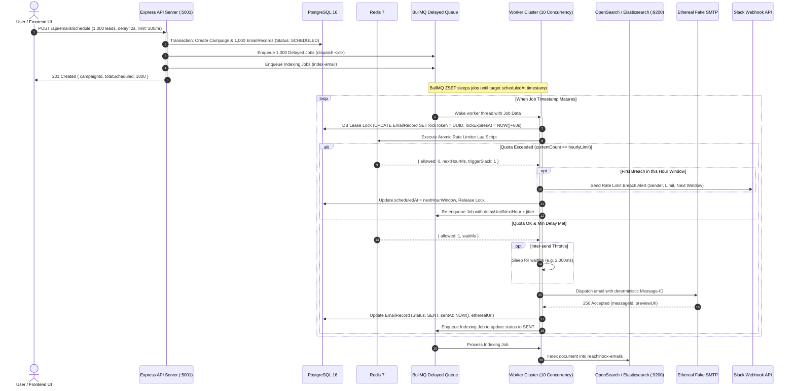

# 📬 ReachInbox Distributed Outbound Email Scheduler & OneBox Hub

[](https://www.typescriptlang.org/)
[](https://nextjs.org/)
[](https://expressjs.com/)
[](https://bullmq.io/)
[](https://redis.io/)
[](https://www.postgresql.org/)
[](https://opensearch.org/)
[](https://tailwindcss.com/)

A production-grade, distributed cold email job scheduling engine and OneBox inbox hub built for the **ReachInbox** engineering hiring assignment. The platform delivers sub-second batch ingestion, deterministic exact-once external email dispatching, atomic multi-worker rate limiting, live Slack alerting, OpenSearch/Elasticsearch full-text search with automatic PostgreSQL fallback, and a pixel-accurate Next.js 14 frontend reproducing all 7 Figma views.

---

## 📑 Table of Contents
1. [Core Architectural Highlights](#-core-architectural-highlights)
2. [System Architecture Diagram](#-system-architecture-diagram)
3. [Figma Screens & Frontend Mapping](#-figma-screens--frontend-mapping)
4. [Distributed Atomic Rate Limiter (Lua Script)](#-distributed-atomic-rate-limiter-lua-script)
5. [Database Schema & Lease Locks](#-database-schema--lease-locks)
6. [Full-Text Search Engine & Resilient Fallback](#-full-text-search-engine--resilient-fallback)
7. [API Specification](#-api-specification)
8. [Quick Start & Local Deployment](#-quick-start--local-deployment)
9. [Automated Verification & Load Testing](#-automated-verification--load-testing)

---

## ⚡ Core Architectural Highlights

### 1. Zero Cron Delayed Scheduling
- **The Problem with Cron**: Traditional scheduled systems poll database tables (`SELECT * FROM emails WHERE scheduled_at <= NOW() AND status = 'PENDING' LIMIT N`). Under scale (e.g. 100,000 scheduled emails), database polling causes disk saturation, race conditions between multiple API servers, and uncoordinated dispatch bursts.
- **The BullMQ Solution**: ReachInbox implements a **Zero Cron** architecture. When a campaign or batch is scheduled, delay offsets (`delayMs = Math.max(0, scheduledAt - Date.now())`) are calculated and pushed directly to **BullMQ delayed sorted sets (`ZSET`)** backed by Redis.
- **Complexity**: Redis internally indexes delayed jobs by Unix epoch timestamps at $O(\log N)$. BullMQ worker clusters wake up exactly when a job is due, consuming zero database CPU cycles during idle wait periods.

### 2. Atomic Distributed Rate Limiting
- Evaluated via a single atomic **Redis Lua script (`EVALSHA`)** running on the Redis engine.
- Prevents race conditions across 10+ concurrent worker processes without slow distributed locks.
- Concurrently enforces **both**:
  1. **Sliding Hourly Quotas**: Maximum emails a sender can dispatch in an hour (e.g., 200 emails/hour).
  2. **Inter-Lead Delays**: Minimum delay between consecutive sends for the same sender (e.g., 2 seconds).

### 3. Next-Hour Overflow Rescheduling with Jitter
- If an email job awakens but the sender has already exhausted their hourly quota, the worker **never fails or drops the job**.
- Instead, the worker recalculates the delay until the top of the next hour window (`nextHourTimestamp - now + jitter`) and automatically re-enqueues the job back into BullMQ.
- Random jitter (50ms–500ms) prevents the **thundering herd problem** at `:00` minutes.

### 4. Deduplicated Slack Rate-Limit Alerts
- When a sender identity hits its rate limit, an alert is sent to Slack via Webhook.
- To prevent spamming channels with hundreds of identical alerts during high-volume campaigns, the Redis Lua script tracks an atomic `slack_notified` flag with a 2-hour TTL.
- **Exactly one alert** is dispatched on the very first breach of each hourly window.

### 5. OpenSearch / Elasticsearch with Transparent PostgreSQL Fallback
- Sub-50ms full-text search across `subject`, `bodyText`, `recipientEmail`, and `recipientName` with field-level boosting and fuzzy matching (`fuzziness: 'AUTO'`).
- Asynchronous BullMQ background indexing queue (`email-indexing-queue`) prevents search syncing from slowing down email ingestion.
- If the search cluster is unreachable or experiences network timeouts, the system automatically falls back to PostgreSQL `ILIKE` queries with zero downtime.

---

## 🏛️ System Architecture Diagram



---

## 🎨 Figma Screens & Frontend Mapping

The frontend is built with **Next.js 14 App Router** and **Tailwind CSS**, matching the Figma reference screenshots located in `docs/figma/`:

| Screen # | Figma Asset Reference | Frontend Component / Page | Description |
|---|---|---|---|
| **01** | `01_login_screen.png` | [`src/app/login/page.tsx`](frontend/src/app/login/page.tsx) | Clean white card, Google OAuth button (`#E1F5EC`), email/password inputs, `#00A854` Login button, and Oliver Brown quick login. |
| **02** | `02_homepage_scheduled.png` | [`src/components/layout/Sidebar.tsx`](frontend/src/components/layout/Sidebar.tsx)<br>[`src/components/emails/EmailList.tsx`](frontend/src/components/emails/EmailList.tsx) | Brand logo, user card, active "Scheduled" nav pill (`#E6F7EF`), search bar with latency badge, orange schedule pills (`🕒 Tue 9:15:12 AM`). |
| **03** | `03_homepage_sent.png` | [`src/components/emails/EmailList.tsx`](frontend/src/components/emails/EmailList.tsx) | Active "Sent" nav pill, light gray "Sent" badges, subject, body preview, interactive stars, and live Ethereal test links. |
| **04** | `04_compose_send_later_popover.png` | [`src/components/emails/ComposeModal.tsx`](frontend/src/components/emails/ComposeModal.tsx) | Compose modal with rich text formatting toolbar, From identity picker, and "Send Later" popover with date-time picker and presets. |
| **05** | `05_compose_upload_list_state.png` | [`src/components/emails/ComposeModal.tsx`](frontend/src/components/emails/ComposeModal.tsx) | Send button switches dynamically to "Send Later", paperclip shows attachment count `1`, and `↑ Upload List` action on the right. |
| **06** | `06_compose_lead_chips.png` | [`src/components/emails/ComposeModal.tsx`](frontend/src/components/emails/ComposeModal.tsx) | Recipient chips rendered in green-bordered pills (`tame@jmail.com`, `+N` overflow chip), CSV file parser, and attachment preview cards. |
| **07** | `07_email_detail_thread_view.png` | [`src/components/emails/EmailDetailModal.tsx`](frontend/src/components/emails/EmailDetailModal.tsx) | Thread view with green initial avatar (`A`), yellow callout box (`⚡ Extremely Exclusive... ⚡`), star, archive, delete, and attachment cards. |

---

## 🔒 Distributed Atomic Rate Limiter (Lua Script)

Rate limiting is implemented in Redis Lua (`backend/src/services/rate-limiter.service.ts`) ensuring atomic operations:

```lua
local hourlyKey = KEYS[1]
local lastSendKey = KEYS[2]
local slackNotifiedKey = KEYS[3]

local maxPerHour = tonumber(ARGV[1])
local minDelayMs = tonumber(ARGV[2])
local nowMs = tonumber(ARGV[3])
local nextHourWindowMs = tonumber(ARGV[4])

-- 1. Check Hourly Limit
local currentCount = tonumber(redis.call('GET', hourlyKey) or '0')
if currentCount >= maxPerHour then
    local alreadyNotified = redis.call('GET', slackNotifiedKey)
    local triggerSlack = 0
    if not alreadyNotified then
        redis.call('SET', slackNotifiedKey, '1', 'EX', 7200)
        triggerSlack = 1
    end
    return {0, nextHourWindowMs, triggerSlack, currentCount}
end

-- 2. Check Inter-Send Delay
local lastSendTime = tonumber(redis.call('GET', lastSendKey) or '0')
local waitMs = 0
local timeSinceLastSend = nowMs - lastSendTime
if timeSinceLastSend < minDelayMs then
    waitMs = minDelayMs - timeSinceLastSend
end

-- 3. Atomic Allocation
local newCount = redis.call('INCR', hourlyKey)
if newCount == 1 then
    redis.call('EXPIRE', hourlyKey, 7200)
end

local scheduledSendTime = nowMs + waitMs
redis.call('SET', lastSendKey, tostring(scheduledSendTime), 'EX', 3600)

return {1, waitMs, 0, newCount}
```

---

## 📊 Database Schema & Lease Locks

PostgreSQL 16 models defined via Prisma (`backend/prisma/schema.prisma`):

```prisma
enum EmailStatus {
  SCHEDULED
  QUEUED
  SENT
  FAILED
  CANCELLED
}

model EmailRecord {
  id             String       @id @default(uuid())
  userId         String
  senderId       String
  campaignId     String?
  recipientEmail String
  recipientName  String?
  subject        String
  bodyText       String
  bodyHtml       String?
  status         EmailStatus  @default(SCHEDULED)
  scheduledAt    DateTime
  sentAt         DateTime?
  etherealUrl    String?
  smtpMessageId  String?
  idempotencyKey String       @unique
  lockToken      String?
  lockExpiresAt  DateTime?
  createdAt      DateTime     @default(now())
  updatedAt      DateTime     @updatedAt

  user           User         @relation(fields: [userId], references: [id], onDelete: Cascade)
  sender         SenderIdentity @relation(fields: [senderId], references: [id], onDelete: Cascade)
  campaign       Campaign?    @relation(fields: [campaignId], references: [id], onDelete: SetNull)

  @@index([userId, status])
  @@index([senderId, scheduledAt])
  @@index([status, scheduledAt])
}
```

### Two-Phase DB Lease Locking
Before dispatching to external SMTP, a worker executes an atomic conditional lease:
```sql
UPDATE "EmailRecord"
SET "lockToken" = :workerId, "lockExpiresAt" = NOW() + INTERVAL '60 seconds'
WHERE "id" = :emailId
  AND ("lockExpiresAt" IS NULL OR "lockExpiresAt" < NOW())
  AND "status" = 'SCHEDULED';
```
If a worker crashes mid-flight, the lock expires automatically in 60 seconds without permanently stranding the email.

---

## 🔍 Full-Text Search Engine & Resilient Fallback

ReachInbox implements full-text search across four email fields with custom scoring:
- **`subject`**: 3x boost (`subject^3`)
- **`recipientEmail`**: 2x boost (`recipientEmail^2`)
- **`recipientName`**: 1.5x boost (`recipientName^1.5`)
- **`bodyText`**: 1x boost (`bodyText^1`) with `english` analyzer stemming

### PostgreSQL Fallback Guarantee
If the OpenSearch / Elasticsearch cluster is down, unreachable, or returns a 5xx error, `ElasticsearchService.searchEmails()` catches the exception and executes an equivalent case-insensitive `ILIKE` query against PostgreSQL:
```ts
return {
  items,
  total,
  page,
  limit,
  totalPages: Math.ceil(total / limit),
  tookMs: Date.now() - startTime,
  engine: 'postgresql_fallback', // transparently reported to client
};
```

---

## 📡 API Specification

All routes are prefixed with `/api` and accept/return JSON:

| Method | Endpoint | Description |
|---|---|---|
| `GET` | `/api/health` | Healthcheck verifying PostgreSQL & Redis connectivity. |
| `POST` | `/api/auth/dev-login` | Issue JWT cookie for test user (Oliver Brown). |
| `GET` | `/api/auth/me` | Fetch authenticated user profile & Slack connection status. |
| `POST` | `/api/auth/logout` | Clear session cookie. |
| `GET` | `/api/auth/google/url` | Generate Google OAuth 2.0 authorization URL. |
| `GET` | `/api/auth/google/callback` | Exchange code for tokens & set session cookie. |
| `GET` | `/api/slack/install` | Generate Slack OAuth install URL with CSRF nonce. |
| `GET` | `/api/slack/callback` | Exchange Slack OAuth code & save encrypted credentials. |
| `DELETE` | `/api/slack/disconnect` | Disconnect Slack integration. |
| `GET` | `/api/senders` | List verified sender identities. |
| `POST` | `/api/emails/schedule` | Transactionally schedule batch of up to 5,000 emails. |
| `GET` | `/api/emails/scheduled` | List paginated scheduled emails. |
| `GET` | `/api/emails/sent` | List paginated sent emails with Ethereal preview links. |
| `GET` | `/api/emails/search` | Sub-50ms full-text search with automatic PG fallback. |
| `GET` | `/api/emails/:id` | Fetch single email record for thread view. |
| `DELETE` | `/api/emails/:id` | Delete email record and sync deletion to search index. |
| `GET` | `/admin/queues` | Live Bull-Board dashboard for queue monitoring. |

---

## 🚀 Quick Start & Local Deployment

### 1. Prerequisites
- **Node.js**: `v18.x` or higher (`v22.x` recommended)
- **Docker & Docker Compose** (or local PostgreSQL, Redis, and OpenSearch)

### 2. Clone & Install Dependencies
```bash
git clone https://github.com/M-A-SAIADITHYAA/Outbox_Labs_Assignment.git
cd Outbox_Labs_Assignment

# Install all workspace dependencies
npm install
npm --prefix backend install
npm --prefix frontend install
```

### 3. Start Infrastructure Services
```bash
# Start PostgreSQL, Redis, and OpenSearch via Docker Compose
docker compose up -d
```
*(Alternatively, if running locally via Homebrew: `brew services start postgresql@16 redis opensearch`)*

### 4. Database Migration & Seeding
```bash
npm --prefix backend run prisma:migrate
npm --prefix backend run prisma:seed
```
*Seeds default user `Oliver Brown <oliver.brown@domain.io>` and 2 sender identities.*

### 5. Start Backend and Frontend
```bash
# Terminal 1: Backend API & Worker Cluster (Port 5001)
npm run dev:backend

# Terminal 2: Next.js 14 Frontend UI (Port 3000)
npm run dev:frontend
```

Open **[http://localhost:3000](http://localhost:3000)** in your browser!
- **Bull-Board Queue Monitoring**: [http://localhost:3000/admin/queues](http://localhost:3000/admin/queues)

---

## 🧪 Automated Verification & Load Testing

The repository contains automated test suites verifying every component:

### 1. 1,000-Email Concurrent Load Simulation
Simulates high-throughput cold email scheduling, asserts BullMQ delayed queue storage, and verifies atomic Redis Lua rate limiting under 25 concurrent worker threads:
```bash
npm --prefix backend run test:load-1000
```
**Expected Output:**
```text
🚀 1,000-EMAIL CONCURRENT SCHEDULING & LOAD SIMULATION
  ✅ PostgreSQL insertion completed in 126ms (7,937 records/sec)
  ✅ 1,000 BullMQ delayed jobs registered in 48ms (20,833 jobs/sec)
  ✅ 1,000 delayed jobs are safely persisted in Redis memory.
  Concurrent Simulation Results (25 requests against limit of 5):
    - Allowed to send immediately:  5
    - Rate limited & rescheduled:   20
    - Slack alerts dispatched:      1
  ✅ Atomic Redis Lua script strictly enforced the hourly quota with zero race conditions.
  ✅ Deduplication verified: exactly 1 Slack alert was emitted for the breach window.
🎉 1,000-EMAIL LOAD SIMULATION PASSED WITH 100% SUCCESS!
```

### 2. Crash Resilience & Persistence Test
Simulates abrupt server process crashes, verifying that Redis preserves all delayed jobs and resumed workers execute them without loss or duplicate dispatching:
```bash
npm --prefix backend run test:crash
```

### 3. OpenSearch Full-Text Search & PostgreSQL Fallback Test
```bash
npm --prefix backend run test:phase5
```

---

## 📜 License
MIT © 2026 M A SAIADITHYAA
